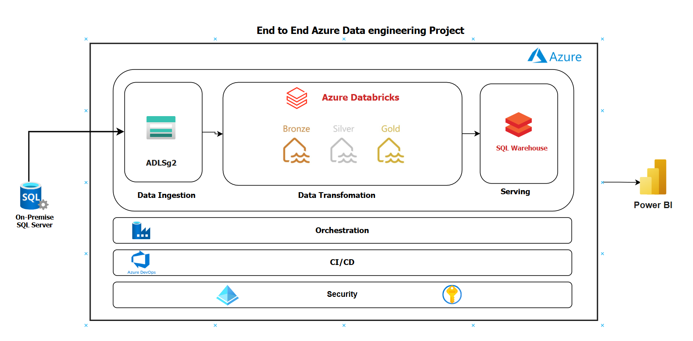
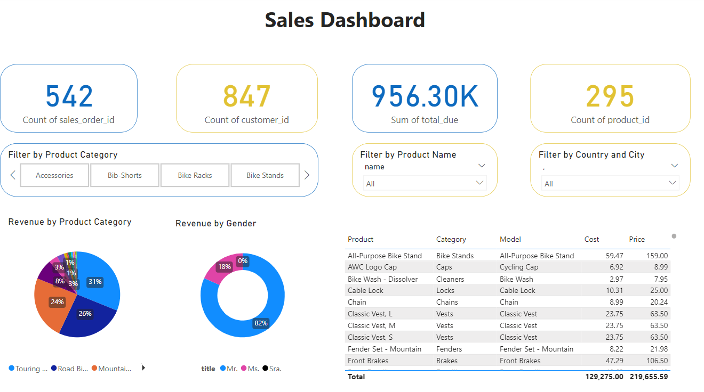

### Project Overview
Welcome to this Azure Data Engineering initiative, designed to showcase a comprehensive data pipeline on Azure for processing and visualizing customer demographic data. Developed as a hands-on learning experience, it adheres to best practices in data architecture, security, and automated deployment. The pipeline extracts information from an on-premises SQL database, processes it through Azure Data Factory and Databricks, and presents key business insights, such as product sales by gender, category, total revenue, and other KPIs, in Power BI.
> **Note:** This project is for learning and demonstration purposes.

### Architecture Diagram

---

### Table of Contents

1. [Project Overview](#project-overview)
2. [Architecture Diagram](#architecture-diagram)
3. [Data Source](#data-source)
4. [Setup and Configuration](#setup-and-configuration)
5. [Data Pipeline](#data-pipeline)
6. [Data Transformation](#data-transformation)
7. [Data Visualization](#data-visualization)
8. [Security](#security)
9. [CI/CD Pipeline](#ci-cd-pipeline)
    
---

### Data Source

- **AdventureWorksLT Database**: This example database features tables for customers, products, and sales, simulating a practical customer analytics use case.

- **Data Storage**: Information is extracted from SQL Server and stored in Azure Data Lake in Parquet format, optimizing it for efficient querying and processing.

For detailed setup instructions, see [`docs/data_source.md`](docs/data_source.md).

### Setup and Configuration

To run this project, the following Azure services must be set up:
   - **Azure Data Factory** for data ingestion
   - **Databricks** for data transformations
   - **Power BI** for visualization

Detailed pipeline steps are documented in docs/data_ingestion.md.

Refer to [`docs/setup.md`](docs/1_setup.md) for the full setup process.

### Data Pipeline Overview

**Azure Data Factory** is responsible for orchestrating the data movement and transformation workflow. Data is extracted from an on-premises SQL Server and loaded into Azure Data Lake in Parquet format.

Detailed pipeline steps are documented in docs/2_data_ingestion.md

### Data Transformation

Data transformation is handled in **Databricks**, organized in three layers:
   - **Bronze** ->  **Silver** ->  **Gold**: 

Further processing details are available in  [`docs/data_transformation.md`](docs/3_data_transformation.md).

### Data Visualization

**Power BI** connects directly to Databricks, offering users interactive visualizations and the ability to filter data based on attributes such as gender and product category.

For dashboard setup instructions, visit  [`docs/data_visualization.md`](docs/4_data_visualization.md).

### Security

Security in this project is maintained through:
   - **Azure Key Vault**: Secure storage for secrets and credentials..
   - **Managed Identities**: Ensures secure inter-service connections without credential exposure.
   - **Entra ID**: Implements role-based access control (RBAC) for user management.

Refer to [`docs/security.md`](docs/5_security.md) for more on security setup.

### CI/CD Pipeline

**Azure DevOps** is utilized with ARM templates to automate deployment, facilitating reproducibility and easy modifications.

See [`docs/cicd.md`](docs/6_cicd.md) for the CI/CD setup.

---

